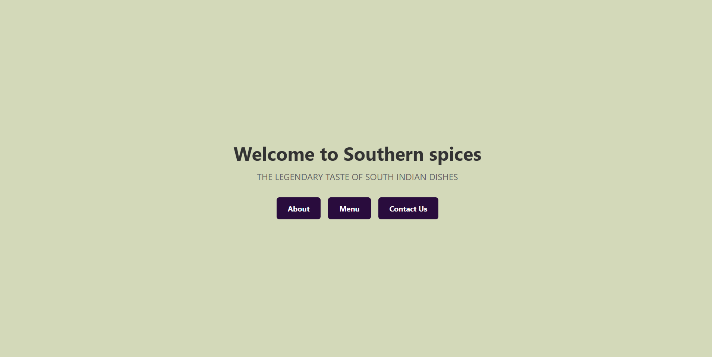
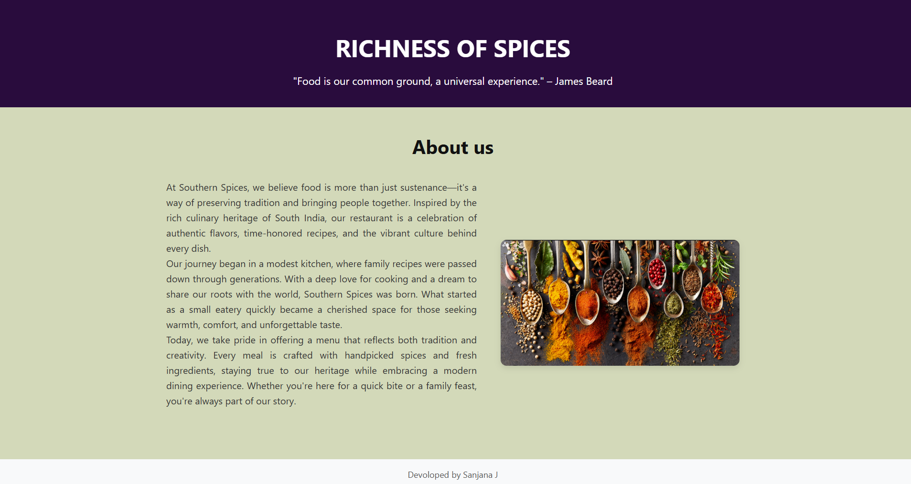
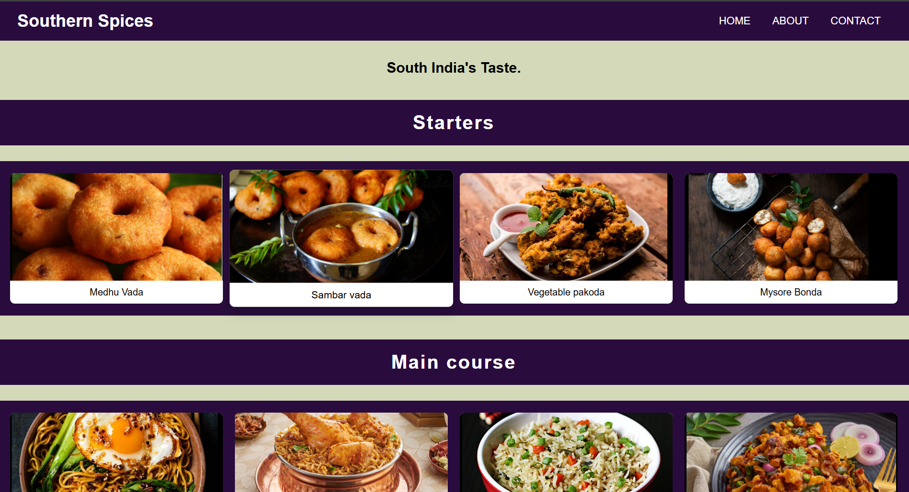
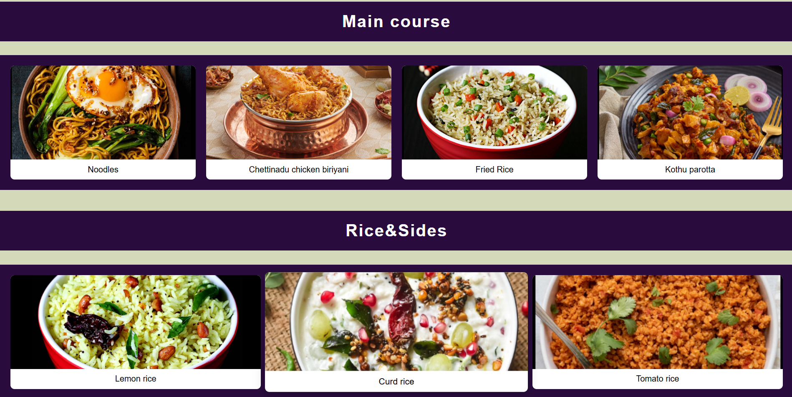
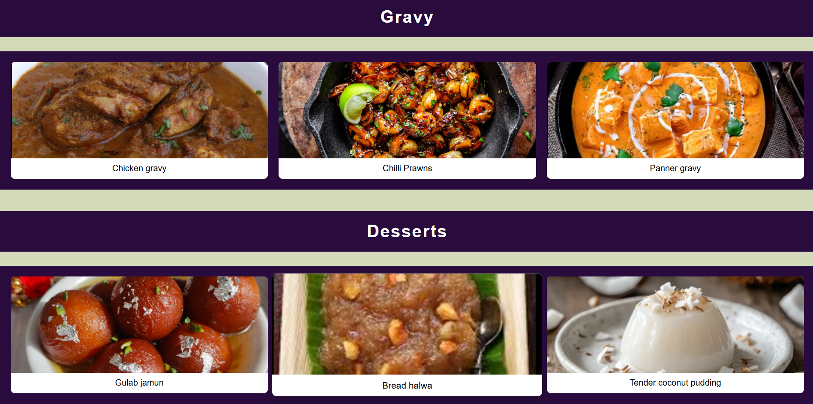
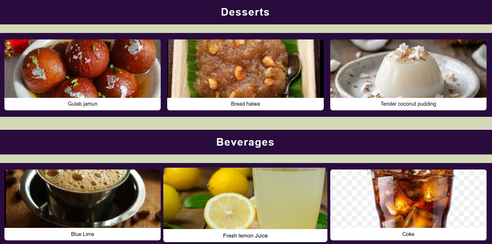
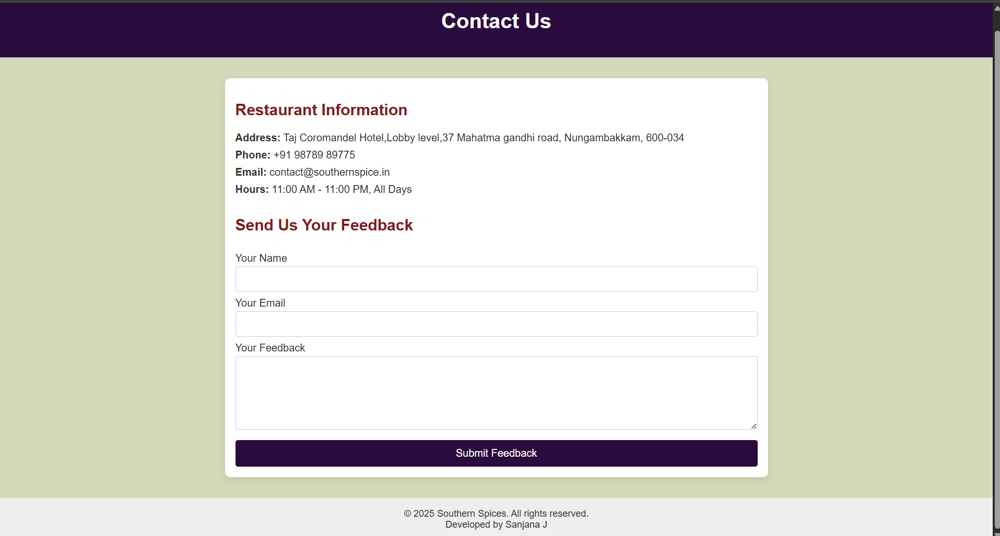

# Ex.07 Restaurant Website
# Date:3.05.25
# AIM:
To develop a static Restaurant website to display the food items and services provided by them.

# DESIGN STEPS:
## Step 1:
Requirement collection.

## Step 2:
Creating the layout using HTML and CSS.

## Step 3:
Updating the sample content.

## Step 4:
Choose the appropriate style and color scheme.

## Step 5:
Validate the layout in various browsers.

## Step 6:
Validate the HTML code.

## Step 7:
Publish the website in the given URL.

# PROGRAM:
```
home.html

<!DOCTYPE html>
<html lang="en">
<head>
    <title>Southern spices</title>
    <style>
        /* Reset and full height layout */
        * {
            margin: 0;
            padding: 0;
            box-sizing: border-box;
        }

        html, body {
            height: 100%;
            font-family: 'Segoe UI', Tahoma, Geneva, Verdana, sans-serif;
            background: url('bg.jpg') no-repeat center center fixed;
            background-size: cover;
            display: flex;
            flex-direction: column;
        }

        /* Center container */
        .container {
            flex: 1;
            display: flex;
            flex-direction: column;
            align-items: center;
            justify-content: center;
            text-align: center;
            padding: 40px 20px;
            background-color: #d3d9b9;
        }

        .container h1 {
            font-size: 2.5rem;
            margin-bottom: 10px;
            color: #333;
        }

        .container p {
            font-size: 1.2rem;
            color: #666;
        }
        .button-group {
            display: flex;
            justify-content: center;
            gap: 1rem;
            margin-top: 2rem;
        }
        .btn {
            background-color: #290c3d;
            color: white;
            padding: 0.8rem 1.5rem;
            border-radius: 6px;
            text-decoration: none;
            font-weight: bold;
            transition: background-color 0.3s;
        }
        .btn:hover {
            background-color: #060106;
        }

        footer {
            text-align: center;
            padding: 15px;
            background-color: #070107;
            font-size: 0.9rem;
            color: #555;
        }
    </style>
</head>
<body>

    <div class="container">
        <h1>Welcome to Southern spices</h1>
        <p>THE LEGENDARY TASTE OF SOUTH INDIAN DISHES</p>
        <div class="button-group">
            <a href="about.html" class="btn">About</a>
            <a href="menu.html" class="btn">Menu</a>
            <a href="contact.html" class="btn">Contact Us</a>
          </div>
    </div>

    <footer>
        Devoloped by Sanjana J
    </footer>

</body>
</html>

about.html

<!DOCTYPE html>
<html lang="en">
<head>
  <title>About Us - Southern spices</title>
  <style>

    * {
      margin: 0;
      padding: 0;
      box-sizing: border-box;
    }

    body {
      font-family: 'Segoe UI', Tahoma, Geneva, Verdana, sans-serif;
      line-height: 1.6;
      background-color: #d3d9b9;
      color: #333;
      display: flex;
      flex-direction: column;
      min-height: 100vh;
    }

    header {
      background-color: #290c3d;
      color: white;
      text-align: center;
      padding: 50px 20px 30px;
    }

    header h1 {
      font-size: 2.5rem;
    }

    header p {
      font-size: 1.1rem;
      margin-top: 10px;
    }

    .content {
      flex: 1;
      padding: 40px 20px;
      max-width: 1000px;
      margin: auto;
      text-align: center;
    }

    .content h2 {
      font-size: 2rem;
      margin-bottom: 30px;
      color: #111;
    }

    .about-container {
      display: flex;
      flex-direction: column;
      align-items: center;
    }

    .about-text {
      text-align: justify;
      font-size: 1rem;
      max-width: 800px;
      margin-bottom: 30px;
    }

    .about-image {
      max-width: 100%;
      height: auto;
      border-radius: 10px;
      box-shadow: 0 4px 10px rgba(0, 0, 0, 0.1);
    }

    footer {
      background-color: #f8f9fa;
      padding: 15px;
      text-align: center;
      font-size: 0.9rem;
      color: #555;
    }

    @media (min-width: 768px) {
      .about-container {
        flex-direction: row;
        gap: 40px;
        justify-content: space-between;
      }

      .about-text {
        flex: 1;
      }

      .about-image {
        flex: 1;
        max-width: 400px;
      }
    }
  </style>
</head>
<body>

  <header>
    <h1>RICHNESS OF SPICES</h1>
    <p>"Food is our common ground, a universal experience." – James Beard</p>
  </header>

  <div class="content">
    <h2>About us</h2>
    <div class="about-container">
      <div class="about-text">
        <p>
            At Southern Spices, we believe food is more than just sustenance—it's a way of preserving tradition and bringing people together. Inspired by the rich culinary heritage of South India, our restaurant is a celebration of authentic flavors, time-honored recipes, and the vibrant culture behind every dish.
        </p>
        <p>
            Our journey began in a modest kitchen, where family recipes were passed down through generations. With a deep love for cooking and a dream to share our roots with the world, Southern Spices was born. What started as a small eatery quickly became a cherished space for those seeking warmth, comfort, and unforgettable taste.
        </p>
        <p>
            Today, we take pride in offering a menu that reflects both tradition and creativity. Every meal is crafted with handpicked spices and fresh ingredients, staying true to our heritage while embracing a modern dining experience. Whether you're here for a quick bite or a family feast, you're always part of our story.


        </p>
      </div>
      
    </div>
  </div>

  <footer>
    Devoloped by Sanjana J 
  </footer>

</body>
</html>

menu.html

<!DOCTYPE html>
<html lang="en">
<head>
  <title>Menu - Dindigul Thalappakatti</title>
  <style>
    body {
      margin: 0;
      font-family: Arial, sans-serif;
      background-color: #d3d9b9;
      color: #000;
    }

    header {
      background-color: #290c3d;
      padding: 1rem;
      display: flex;
      justify-content: space-between;
      align-items: center;
      color: white;
    }

    header h1 {
      margin: 0;
      font-size: 1.8rem;
      padding-left: 1rem;
    }

    nav a {
      color: white;
      text-decoration: none;
      margin-right: 2rem;
      font-size: 1.1rem;
    }

    .tagline {
      font-size: 1.5rem;
      font-weight: bold;
      text-align: center;
      margin: 2rem 0 1rem 0;
    }

    h2 {
      text-align: center;
      color: #fff;
      background-color: #290c3d;
      padding: 20px;
      margin-top: 40px;
      font-size: 2rem;
      letter-spacing: 2px;
    }

    .gallery {
      display: grid;
      grid-template-columns: repeat(auto-fit, minmax(220px, 1fr));
      gap: 20px;
      padding: 20px;
      background-color: #290c3d;
    }

    .gallery-item {
      background-color: #fff;
      border-radius: 8px;
      overflow: hidden;
      text-align: center;
      transition: transform 0.3s ease, box-shadow 0.3s ease;
    }

    .gallery-item:hover {
      transform: scale(1.05);
      box-shadow: 0 8px 20px rgba(0,0,0,0.2);
    }

    .gallery-item img {
      width: 100%;
      height: 180px;
      object-fit: cover;
      display: block;
    }

    .gallery-item p {
      margin: 10px;
      font-weight: 500;
    }

    @media (max-width: 600px) {
      h2 {
        font-size: 1.5rem;
      }
    }
  </style>
</head>
<body>
  <header>
    <h1>Southern Spices</h1>
    <nav>
      <a href="home.html">HOME</a>
      <a href="about.html">ABOUT</a>
      <a href="contact.html">CONTACT</a>
    </nav>
  </header>

  <div class="tagline">
    South India's Taste.
  </div>

  <!-- Starters -->
  <h2>Starters</h2>
  <div class="gallery">
    <div class="gallery-item">
      
      <p>Medhu Vada</p>
    </div>
    <div class="gallery-item">
      
      <p>Sambar vada</p>
    </div>
    <div class="gallery-item">
      
      <p>Vegetable pakoda</p>
    </div>
    <div class="gallery-item">
        
        <p>Mysore Bonda</p>
      </div>
  </div>

  <!-- Main course -->
  <h2>Main course</h2>
  <div class="gallery">
    <div class="gallery-item">
      
      <p>Noodles</p>
    </div>
    
    <div class="gallery-item">
      
      <p>Chettinadu chicken biriyani</p>
    </div>
    <div class="gallery-item">
        
        <p>Fried Rice</p>
    </div>
    <div class="gallery-item">
        
        <p>Kothu parotta</p>
    </div>
  </div>

  <!-- Rice & Sides -->
  <h2>Rice&Sides</h2>
  <div class="gallery">
    <div class="gallery-item">
      
      <p>Lemon rice</p>
    </div>
    <div class="gallery-item">
      
      <p>Curd rice</p>
    </div>
    <div class="gallery-item">
      
      <p>Tomato rice</p>
    </div>
  </div>

  <!-- Gravy -->
  <h2>Gravy</h2>
  <div class="gallery">
    <div class="gallery-item">
      
      <p>Chicken gravy</p>
    </div>
    <div class="gallery-item">
      
      <p>Chilli Prawns</p>
    </div>
    <div class="gallery-item">
      
      <p>Panner gravy</p>
    </div>
  </div>

  <!-- Desserts -->
  <h2>Desserts</h2>
  <div class="gallery">
    <div class="gallery-item">
      
      <p>Gulab jamun</p>
    </div>
    <div class="gallery-item">
      
      <p>Bread halwa</p>
    </div>
    <div class="gallery-item">
      
      <p>Tender coconut pudding</p>
    </div>
  </div>

  <!-- Beverages -->
  <h2>Beverages</h2>
  <div class="gallery">
    <div class="gallery-item">
      
      <p>Blue Lime</p>
    </div>
    <div class="gallery-item">
      
      <p>Fresh lemon Juice</p>
    </div>
    <div class="gallery-item">
      
      <p>Coke</p>
    </div>
  </div>
</body>
</html>

contact.html

<!DOCTYPE html>
<html lang="en">
<head>
  <title>Contact Us - Southern spices</title>
  <style>
    body {
      font-family: Arial, sans-serif;
      margin: 0;
      background-color: #d3d9b9;
      color: #333;
    }

    header {
      background-color: #290c3d;
      color: white;
      padding: 1rem;
      text-align: center;
    }

    .container {
      max-width: 800px;
      margin: 2rem auto;
      padding: 1rem;
      background-color: white;
      border-radius: 8px;
      box-shadow: 0 4px 12px rgba(0, 0, 0, 0.1);
    }

    h2 {
      color: #7d1c1c;
    }

    .contact-info {
      margin-bottom: 2rem;
    }

    .contact-info p {
      margin: 0.5rem 0;
    }

    form {
      display: flex;
      flex-direction: column;
    }

    label {
      margin: 0.5rem 0 0.2rem;
    }

    input, textarea {
      padding: 0.6rem;
      border: 1px solid #ccc;
      border-radius: 4px;
      font-size: 1rem;
    }

    textarea {
      resize: vertical;
    }

    button {
      margin-top: 1rem;
      background-color: #290c3d;
      color: white;
      padding: 0.7rem;
      border: none;
      border-radius: 4px;
      font-size: 1rem;
      cursor: pointer;
    }

    button:hover {
      background-color: #290c3d;
    }

    footer {
      text-align: center;
      padding: 1rem;
      margin-top: 2rem;
      background-color: #eee;
      font-size: 0.9rem;
    }
  </style>
</head>
<body>
  <header>
    <h1>Contact Us</h1>
  </header>

  <div class="container">
    <section class="contact-info">
      <h2>Restaurant Information</h2>
      <p><strong>Address:</strong> Taj Coromandel Hotel,Lobby level,37 Mahatma gandhi road, Nungambakkam, 600-034</p>
      <p><strong>Phone:</strong> +91 98789 89775</p>
      <p><strong>Email:</strong> contact@southernspice.in</p>
      <p><strong>Hours:</strong> 11:00 AM - 11:00 PM, All Days</p>
    </section>

    <section class="feedback-form">
      <h2>Send Us Your Feedback</h2>
      <form action="#" method="POST">
        <label for="name">Your Name</label>
        <input type="text" id="name" name="name" required />

        <label for="email">Your Email</label>
        <input type="email" id="email" name="email" required />

        <label for="message">Your Feedback</label>
        <textarea id="message" name="message" rows="5" required></textarea>

        <button type="submit">Submit Feedback</button>
      </form>
    </section>
  </div>

  <footer>
    &copy; 2025 Southern Spices. All rights reserved.<BR>
    Developed by Sanjana J 
  </footer>
</body>
</html>


```
# OUTPUT:
 
 
 
 
 

 
# RESULT:
The program for designing software company website using HTML and CSS is completed successfully.
